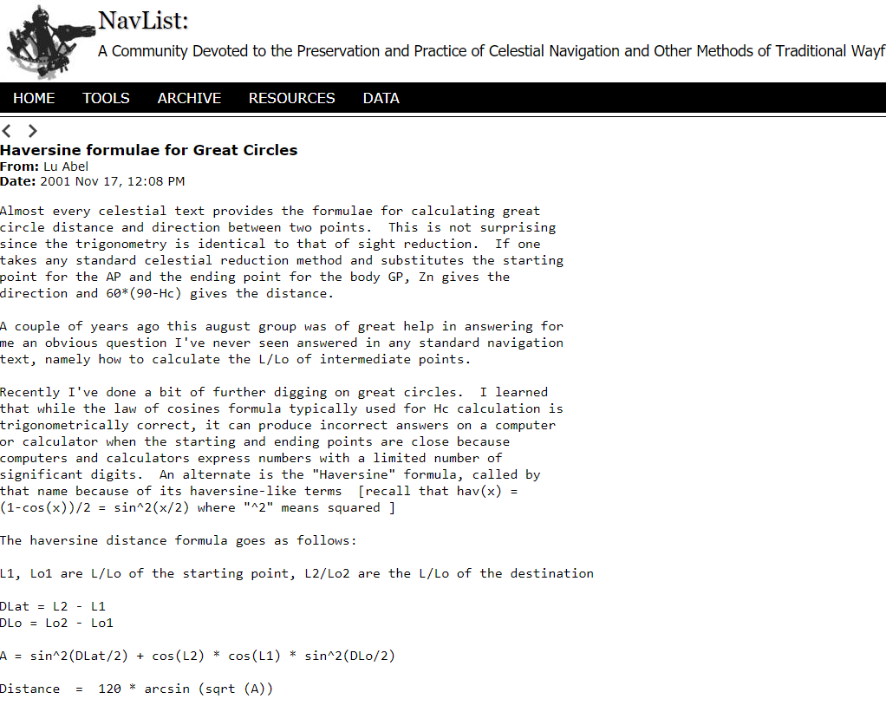

## Modelos de economía circular

¿Cómo un modelo de análisis de cobertura se puede implementar en un proceso de recolección de residuos de café en cafeterías de Lima en el entorno de la economía circular?.


##

```{r message=FALSE, warning=FALSE, include=FALSE}
library(geosphere)
library(tidyverse)
library(readxl)
library(leaflet)
library(leaflet.extras)
#library(leaflet.extras2)
library(magrittr)
```


```{r}


setwd("D:/EMPRESA TAQUIAGUTIERREZ/asignacionDemandaAplicacionEnLinea")
demandaGrupo1 <- read_excel("demandaGrupo1.xlsx")
demandaGrupo2 <- read_excel("demandaGrupo2.xlsx")
dataLocales<- read_excel("geolocalizacion.xlsx")
rows1<-length(na.omit(demandaGrupo2$Address))
rows2<-length(na.omit(dataLocales$Address))

myList <- list()
# set de lists
for(i in 1:rows1){
  element<-c(demandaGrupo2$Longitud[i],demandaGrupo2$Latitud[i])
  myList[[length(myList)+1]] <- list(element)
}

```

```{r include=FALSE}


# Initial list:
myListLocales <- list()
# Now the new experiments
for(i in 1:rows2){
  element<-c(dataLocales$lng[i],dataLocales$lat[i])
  myListLocales[[length(myListLocales)+1]] <- list(element)
}

length(myListLocales)
localAsignado<-c()
asignacion<-list()
valores<-list()
i=1


while(i<=length(myList)) {

  detectaMin<-c()
  for (j in 1:length(myListLocales)){
    valor<-distm(myListLocales[[j]][[1]], myList[[i]][[1]], fun = distHaversine) #one half the versed sine of a given angle or arc
    #The shortest distance between two points (i.e., the 'great-circle-distance' or 'as the crow flies'), according to the 'haversine method'. 
    #This method assumes a spherical earth, ignoring ellipsoidal effects.
    #The versine or versed sine is a trigonometric function found in some of the earliest (Vedic Aryabhatia I) trigonometric tables. The versine of an angle is 1 minus its cosine.
    
    #There are several related functions, most notably the coversine and haversine. The latter, half a versine, is of particular importance in the haversine formula of navigation.
    detectaMin<-c(detectaMin,valor)  
    }
  
  if (valor<12000){
    detectaMin<-c(detectaMin,valor)  
    localAsignado<-which.min(detectaMin)
    asignacion[[length(asignacion)+1]]<-list(localAsignado)
    
    if (i<length(myList)){
      valor1<-distm(myListLocales[[localAsignado]][[1]], myList[[i]][[1]], fun = distHaversine)
      valores[[length(valores)+1]]<-list(valor1) # solo guarda las distancias minimas de los que cumplen la condicion
    }
    
    
    }
  
  
  # Seleccionamos la lista respectiva del local para guardar el valor de distancia minimo contra la tienda
  # Cada local tiene su propia lista de minimos que servira para encontrar el radio del mapa de calor
  #CREAMOS una lista nueva "valores" solo con los minimos en la secuencia de la lista "asignacion"
  #el objetivo es luego reconstruir por cada numero de local las listas con sus valores minimos
  i=i+1
}

valores2<-unlist(asignacion)
locales_con_demanda<-list()
locales_alcance<-list()
radios<-list()
nuevos_valores_min<-list()
nuevos_valores_max<-list()
resultados_min<-0
resultados_max<-0
vacios<-0

for (i in 1:length(myListLocales)){
  
  if (length(which(valores2==i))!=0){
    
    locales_con_demanda[[length(locales_con_demanda)+1]]<-i
    resultados_min<-min(unlist(valores[valores2==i])) # busca la distancia minima entre los indices de todos los valores guardados en la lista "valores"
    resultados_max<-max(unlist(valores[valores2==i])) # busca la distancia maxima entre los indices de todos los valores guardados en la lista "valores"
    radio<-round(resultados_max-resultados_min, digits = 0)
    
    nuevos_valores_min[[length(nuevos_valores_min)+1]]<-resultados_min
    nuevos_valores_max[[length(nuevos_valores_max)+1]]<-resultados_max
    radios[[length(radios)+1]]<-radio
  }
  
    else {    vacios<-vacios+1}
    
  }

```


```{r include=FALSE}

locales_alcance <- dataLocales %>% 
  slice(unlist(locales_con_demanda))


locales_alcance$intensidad<-unlist(radios)

intensidad_maxima<-max(unlist(locales_alcance$intensidad))

locales_alcance<-data.frame(locales_alcance)

list1<-1:nrow(locales_alcance)
list2 <- rep(intensidad_maxima,length(list1))
locales_alcance<- cbind(locales_alcance, list2)
locales_alcance$intensidad<-round(locales_alcance$intensidad/locales_alcance$list2*100, digits = 0)


```

## Slide with Bullets

- Bullet 1
- Bullet 2
- Bullet 3




## Practica con Rmdn


```{r}

lst2 <- unlist(asignacion, use.names = FALSE)
hist(lst2)

```


```{r echo=TRUE}
# definir el centro del mapa
lat_center<-mean(dataLocales$lat) 
long_center <- mean(dataLocales$lng) 

```


## Slide with Plot

```{r echo=TRUE}
# Creamos el mapa de calor para la intensidad 
viz_map_cafe <-locales_alcance %>%leaflet() %>% 
  addTiles() %>% 
  addProviderTiles(providers$OpenStreetMap.DE) %>% 
  setView(long_center,lat_center,14) %>% addHeatmap(lng=~locales_alcance$lng,lat=~locales_alcance$lat, intensity= locales_alcance$intensidad,max=20,radius=20,blur=10)
  
```
##

```{r echo=TRUE}

viz_map_cafe

```

